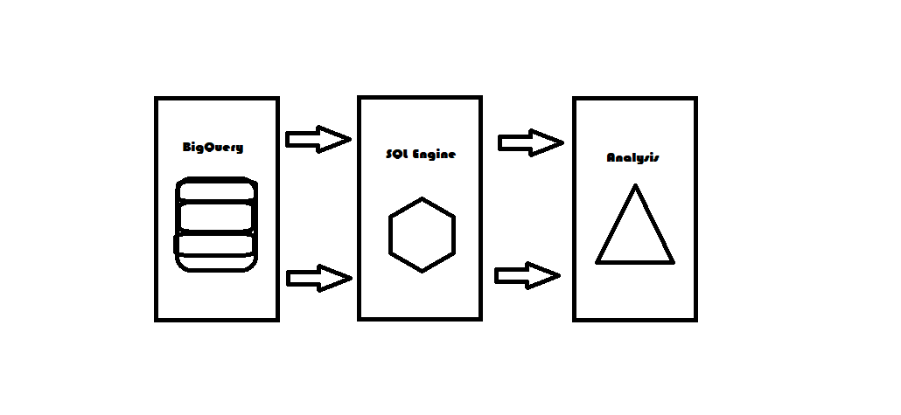
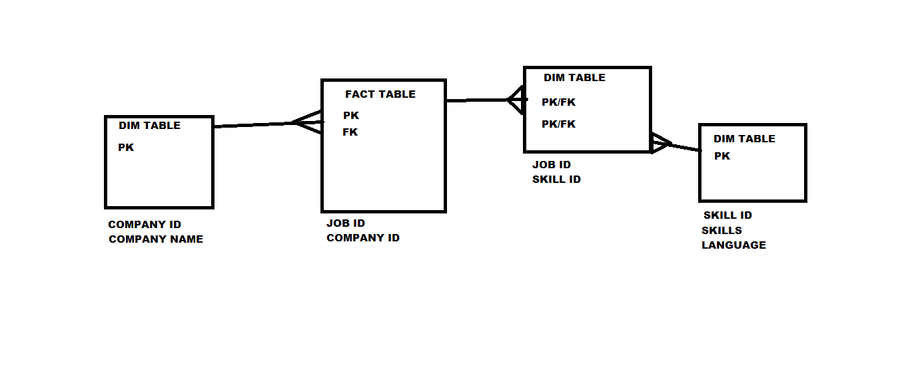
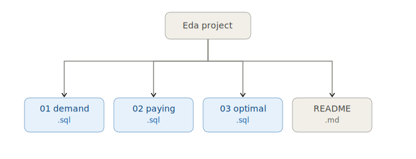
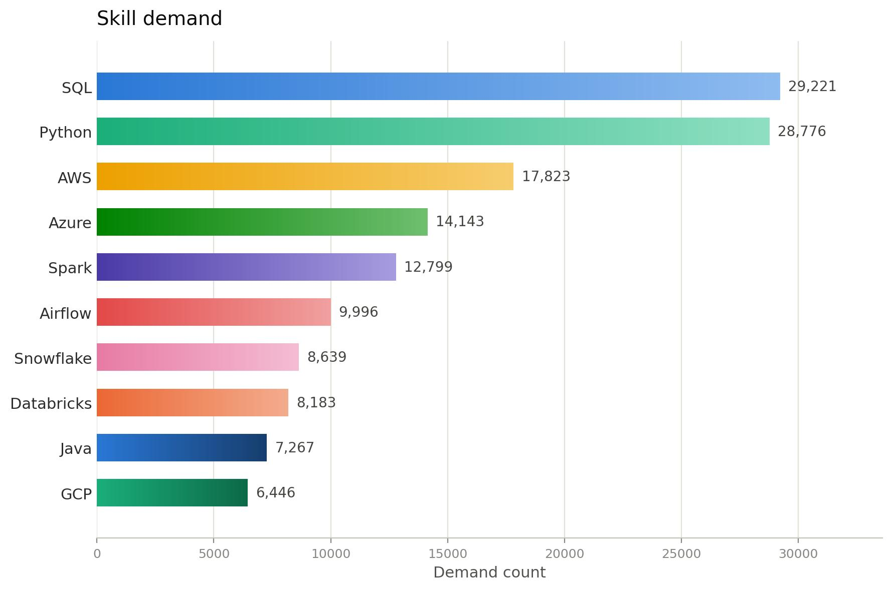
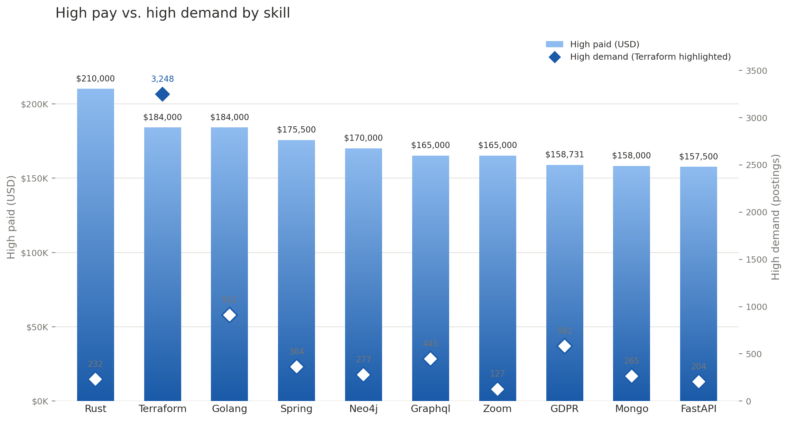
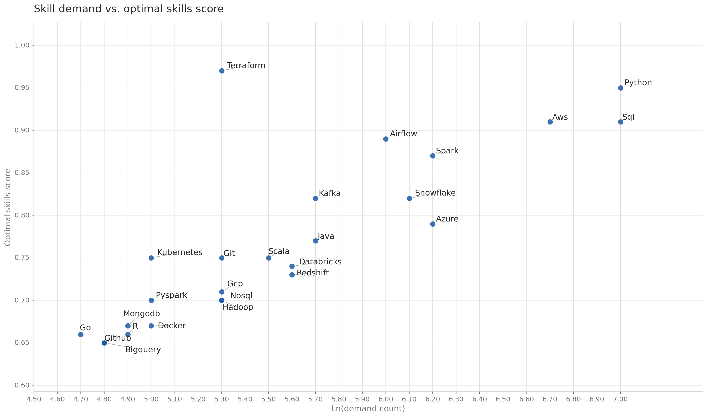

# Exploratory Data Analysis w/ SQL: Job Market Analysis

# Brief Summary
SQL Project for analyzing the data engineer job market using real world job_postings data.
It demonstrates my ability to write production quality queries, design efficient queries, and turn critical business questions into data-driven insights.

This project is helpful for job seakers, job switcher and entere-level engineer how wants to get inform of current job trends, relevant skills and negotiation power.

# Exective Summary (For Managers)

- ✅ **Project Scope**: Built 3 Analytical Queries that answer key problem statement about data engineer job market.
- ✅ **Data Modelling**: Used multi-table joins on fact & dimensions table to extract major insights.
- ✅ **Analytics**: Applied aggregation, filtering and sorting to find top skills by demand, salary and overall value of skill to market.
- ✅ **Outcomes**: Delivered actionable insights on SQL/Python Domaince, cloud trends, and salary pattern.

If you have a minute, review these:

1. [`01.top_demand_skills.sql`](./01.top_demand_skills.sql) - demand analysis with multi-table join.

2. [`02.top_paying_skills.sql`](02.top_paying_skills.sql) - salary analysis with aggregation.
3. [`03.optimal_skills.sql`](03.optimal_skills.sql) - combined demand & salary optimization query.

# Problem Statment & Context

Job Market Analysis wants to answer questions like:

- **Most in-demand skill**: *which skill are most in-demand for data engineers?*
- **Highest Paid Skill**: *which skills command the highest salaries?*
- **Best Trade-off**: *what is the optimal skill set balancing demand and compensation?*

# Tech Stack

- **Query Engine**: Google **BigQuery**.
- **Langauge**: SQL.
- **Data Model**: **Star Schema** (Fact + Dim + Bridge Tables)
- **Version**: Git Bash Command Line (**VS Code**) to push and pull updates to GitHub.
- **Documentation Tool**: VS Code for **Documenting**.
- **Storage**: Google **Cloud Storage**.

# Repository Structure

# Analytical Overview
-  ### Query Structure:
    - **Top Demand Skills:** Identifies the top 10 high demand skills for data engineer roles with WFH Approachities.
    - **Top Paying Skills:** Analyzed the top 25 skills with high compensation salary and demand.
    - **Optimal Skills:** Combined the high demand and compensation, balanced out with log function to find most valuable skills.
- ### Key Insights:
    Here are 5 key insights drawn from the three charts:

    **1. SQL and Python dominate raw demand:**
SQL (29,221) and Python (28,776) lead demand count by a wide margin — nearly double the third-place AWS (17,823). Together they anchor almost every data role, making them the safest, highest-ROI skills to prioritize for broad employability.

    **2. Terraform is the outlier: low demand, highest pay**
Terraform pays the most ($210K... wait, actually Rust pays highest at $210K) with Terraform second at $184K but far lower demand (232–3,248 postings depending on dataset). This signals a niche, specialized skill — fewer job openings, but employers pay a premium for scarce expertise.

    **3. Niche/infra skills command higher salaries than volume skills**
Rust, Terraform, and Golang all pay $184K+ despite modest demand, while high-volume skills like SQL and Python settle around $130–135K. This suggests specialization in emerging or infrastructure-heavy tech pays better per posting than broad, common skills.

    **4. Cloud and orchestration skills balance both demand and pay well**
Airflow, AWS, and Spark sit in the upper-right of the scatter plot — solidly high on both ln(demand) and optimal-skills score (0.87–0.91). These represent the best "sweet spot" skills: strong market pull and strong salary alignment simultaneously.

    **5. Long-tail skills (Go, R, MongoDB, GitHub) show diminishing returns**
Skills clustered at the bottom-left of the scatter plot (demand ~110–150, optimal score 0.65–0.67) offer the least combined value — lower demand and lower optimal-fit scores. These are best treated as supplementary skills rather than primary learning investments.

# Visualization(Non Technical Viewers):
- **Top Demand Skills Analysis**

- **Top Paying Skills Analysis**

- **Optimal Skills Analysis**

# SQL Skills Demonstrated

**Query Structure, Optimization And Analysis Technique**:
- **Multi-table Joins**: Utilized the Star Schema Data Modelling to join Fact to Dimensions:
            - job_postings_fact to company_dim (**1 to M**)
            - job_postings_fact to skills_job_dim(bridge table) (**1 to M**)
            - skills_job_dim(bridge table) to skills_dim (**M to 1**).
        
- **Filters**: According to problem statement we have to only perform analysis on **Data Engineering** Roles with **WFH**(*work from home*) Jobs and take non null values from **`salary_year_avg`** column for **Top Paying Skills**. 
        
- **Grouping**: For all 3 analysis we have to group skills with joins to left side of Fact table.
        `job_postings_fact` - `skills_job_dim` - `skills_dim` 
    
- **Aggregation Filter**: For Both analysis like [`02.top_paying_skills.sql`](02.top_paying_skills.sql) & [`03.optimal_skills.sql`](03.optimal_skills.sql) we have to apply filter on demand count more than 100 job postings for Data Engineer Roles with WFH.
    
- **Printing columns**: 
    
    Top Demand Skills Analysis: Returned`skills` and `demand count` for first analysis.

    Top Paying Skills Analysis: `skills`, `demand count`

    Optimal Skills Analysis:
                **`skills`, `demand count`, `ln_demand_count`(**log transformed**), 
                `median_salary` (high_compensated_salary) and `optimal_skills`(multiply of log transformed demand count and median_salary) (*overall it is normalized*)** 
    
- **Sorting**: Applied `Order by` clause to get `top N records` to sort **descendingly** on all the analysis.
- **Limiting Records**: Applied `limit by N` to get `top N ` records.

Overall what I learned and Used:
- Joins
- Where Clause
- Group By
- Select Distinct
- Having Clause
- Order By
- Limit
- Math Function - log
- conditional cluases - AND,OR,NOT
- operator - &&,||,=,>=,>,<,>,=<,<> /!=.
- AS alias
- Aggregate Functions -
SUM,COUNT,AVG,MIN,MAX,Approx.quantiles(BigQuery) / Median (SQL)
- IS and IS NOT
- NULL
- NULL Handling
